# ROCK_5B 外壳

​		这个项目是ROCK_5B SBC 的外壳   适用版本是1.41（准量产版本

## 注意！！！

​		如果想适用于量产版本的话就需要改动TF卡槽部分（因为我没有量产版本的ROCK 5B所以我无法进行测量，但是我提供了模型工程文件，可以自行进行修改

​		我自己没有3D打印机，采用的是嘉立创三维猴的3D打印代加工服务

​		顶盖 ，底座 ，网络模块 采用的是SLA (光固化)加工的剩下的均是尼龙 3D打印（具体什么方式我不知道因为顶盖 ，底座 ，网络模块这个三个工件比较厚，强度很高，不用担心断裂或者形变，但是其他的一些零件有些比较脆弱，所以需要使用尼龙3D打印

​		强烈建议在打印模型之前对IO侧的开孔间距进行测量，因为当前模型的间距是从我自己的ROCK 5B上测量得到的。

​		

## 成品展示

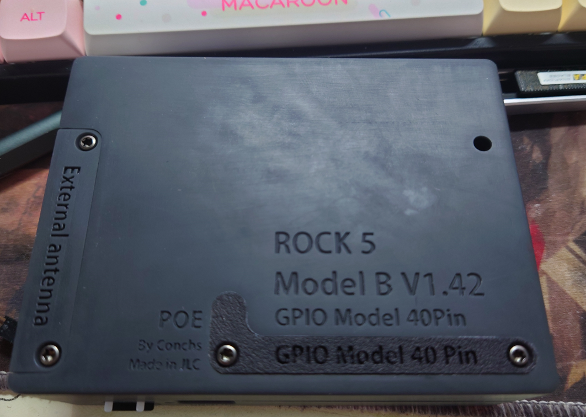

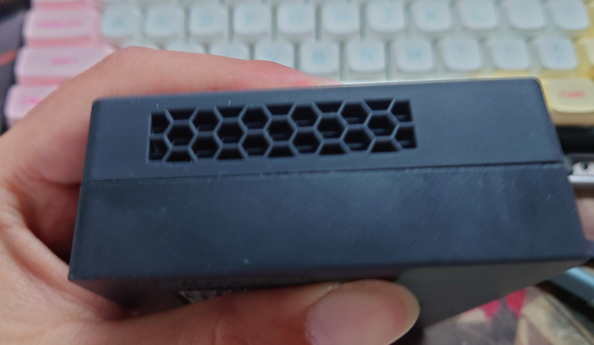

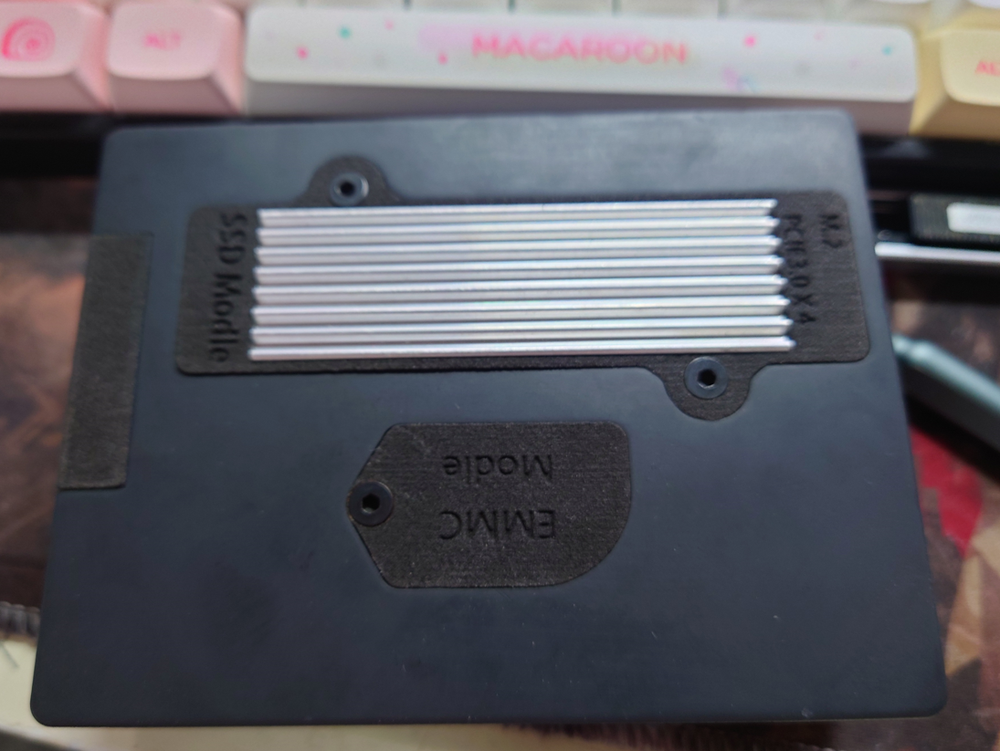

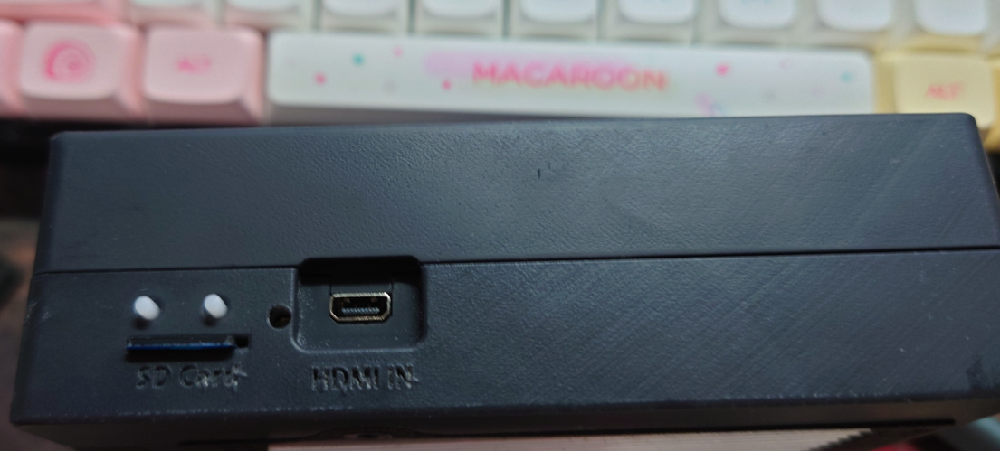

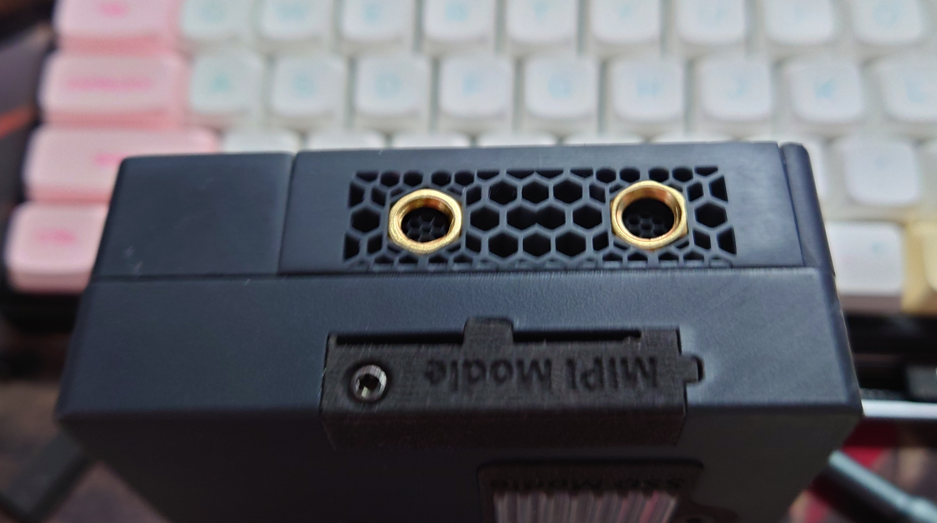

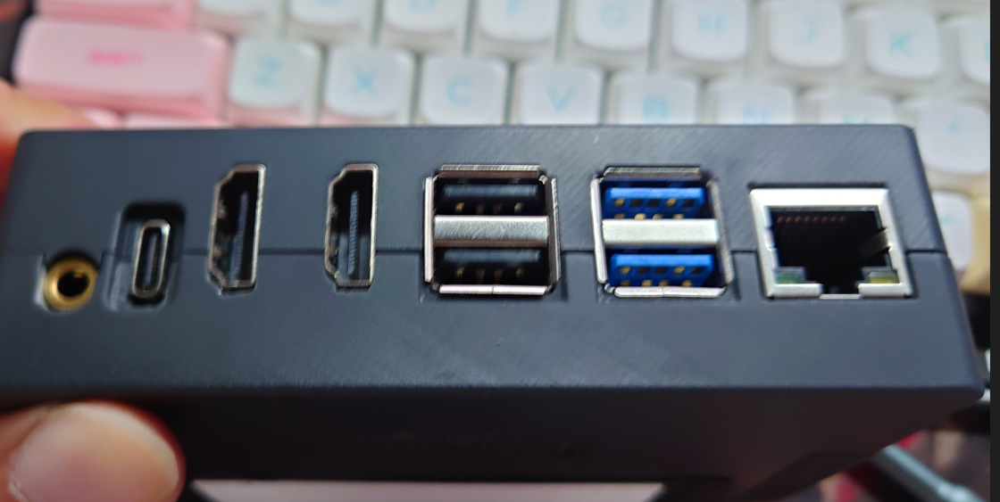

以上就是最终的成品展示。

现在还缺少压力测试，因为散热器还没有进行固定

## 安装

因为我已经完成了模型的安装，有些安装是不可逆的所以我无法展示出来，为了方便我采用模型的方式来展示安装过程

### 安装自攻牙套

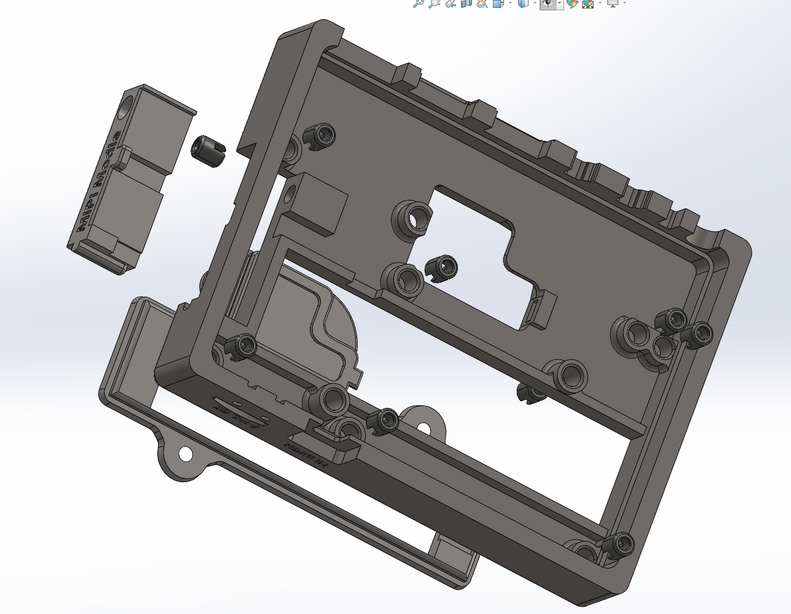

在底座模型上安装自攻牙套（规格 L6   M3  ）

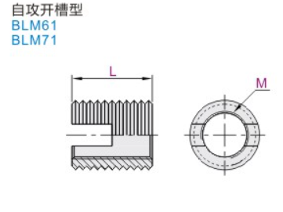

安装方法

1.有专门的安装自攻牙套的工具（推荐，成功率高，难度低，但是要花额外的钱去买工具）

2.准备一个较长的螺丝（最好是内六角的）和一个螺母（均是M3) 然后和牙套一起组装起来

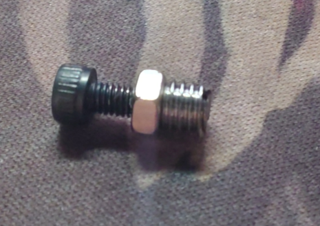

就像这样（因为没用多余的自攻牙套了所以用普通的牙套演示

然后想拧螺丝钉一样将它安装进底座，然后在拧松螺母，这样螺丝就能退出牙套了

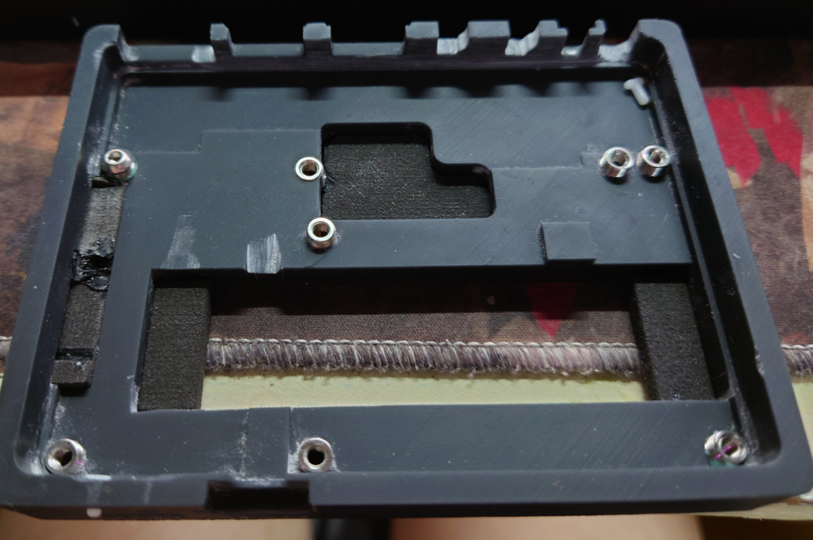

​		安装完成就像这样（如果打滑了也不要紧张，可以加入一些AB胶来进行固定这样就能达到类似的效果）

### 		安装底座

​		接下来就是打磨了，因为每个人的ROCK5B的IO接口间距都不太一样，所以都需要打磨，打磨到能完整放进底座就算成功了（这个就需要耐心和经验了）

​		记得要检查M.2 SSD能否正常安装和拆卸（在ROCK5B安装在底座上的情况下

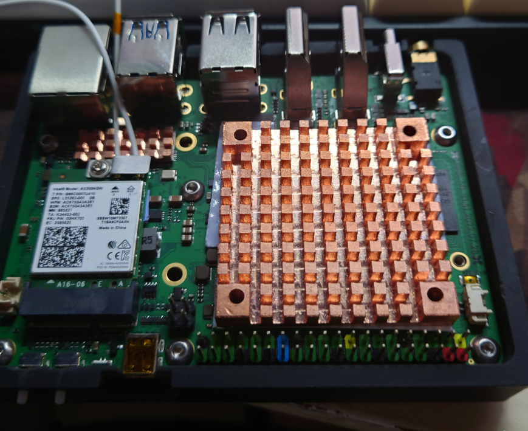

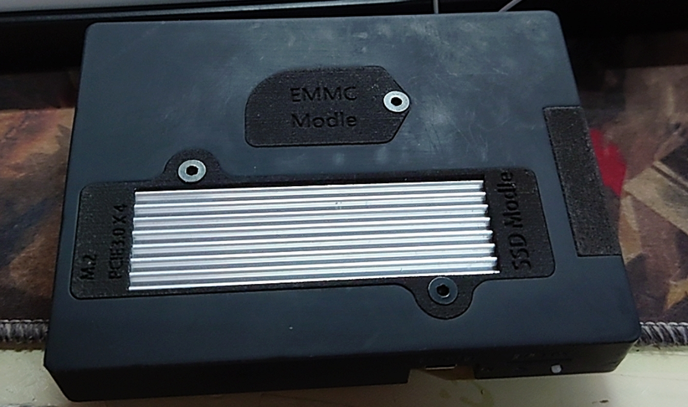

要记得安装按钮延长组件（这个也是需要微调的

### 安装顶盖

到了这一步就能开始安装顶盖了

顶盖的步骤和底座相似，需要打磨IO接口的位置，是否能够让顶盖轻松安装在ROCK5B上，剩下的就是固定螺丝了，然后检查外壳是否还需要调整完成之后就可以准备安装散热器了。（记得贴上内置天线哦，也可以使用外置天线）

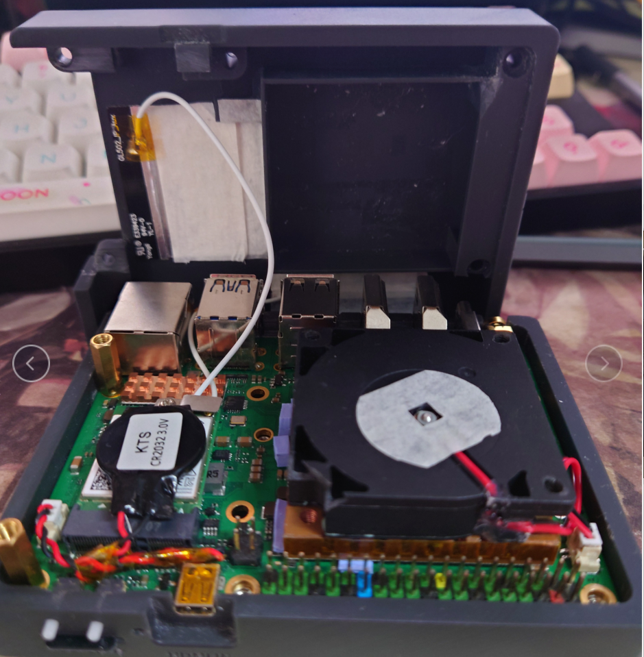

​		散热器使用的是45 *45 *6mm 的散热器，风扇使用的是4510涡轮风扇，起初我打算使用螺丝将散热器和风扇组装起来，发现这样会让外壳无法正常安装，所以就使用双面胶将二者粘起来（可能会有安全隐患，但目前使用还没有出现任何问题，感觉强烈的震动可能会出现问题）

​		首先在rock5B 上除了RK3588 SOC以外的位置贴上2mm的硅胶垫（因为它们高度都不相同，所以需要使用硅胶垫去弥补它们之间的差距）然后在散热器的底面贴上导热胶布（0.1mm厚）然后把散热器装入顶盖的方形凹槽中，再装上rock5B这样就能让散热器粘在rock5B上了（因为各种各样的问题让我不愿意用螺丝固定散热器，虽然我也知道这不是一个好办法）

PS:散热器左侧有两颗小芯片没有覆盖到，据说是SOC的供电芯片，所以我打算使用超厚的硅胶垫来充当散热器贴上去了（反正官方也没用强调需要对其进行散热，想必发热应该不会很严重所以就只是象征性地贴上了

到此就算完成外壳和散热器的组装了

